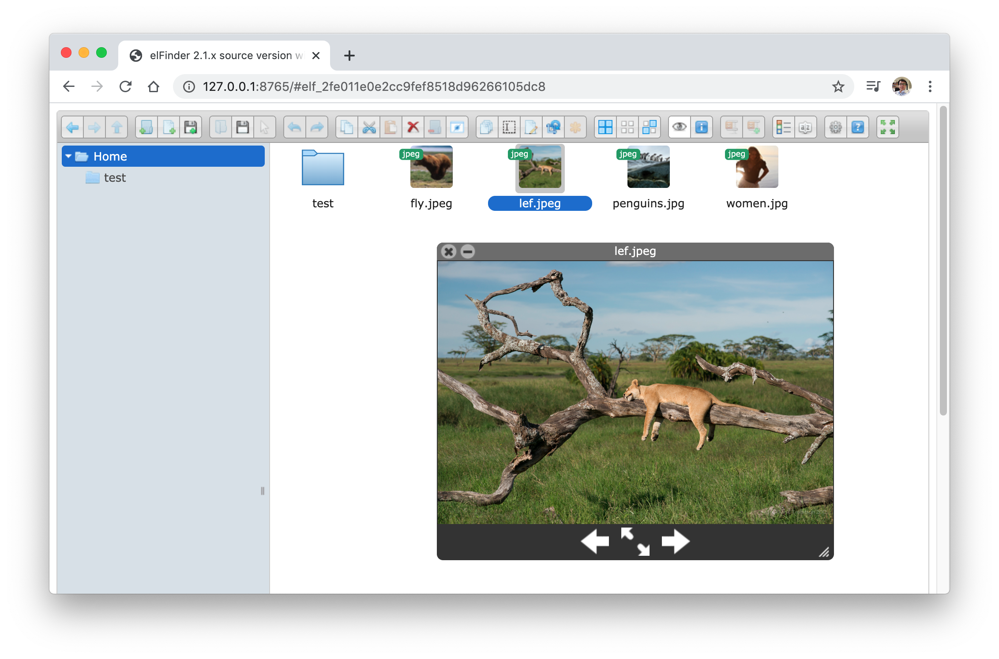

# elFinder connector for Jupyter server proxy

This elFinder is specificly built for the [ImJoy](https://imjoy.io) project, an open source platform for deploying computational tools to the end user.

## What is elFinder
elFinder is a Open-source file manager for web, written in JavaScript using jQuery and jQuery UI, [the project](https://github.com/Studio-42/elfinder) is maintained by [Studio 42](https://github.com/Studio-42).

## Installation

```
pip install -U jupyter-elfinder
```

## Basic Usage
```
jupyter-elfinder
```

You will then see the following message
```
==========Jupyter elFinder server is running=========
http://127.0.0.1:8765
```

By default, it will browse the example data folder. In order to browse your own directory, you can set it by passing `--root-dir=/PATH/TO/MY/FOLDER`.




## Use it with remote Jupyter notebook server

If you don't have jupyter notebook, run 
```
pip install -U jupyter
```

Next, install jupyter server proxy:
```
pip install -U jupyter-server-proxy
```

Now start Juptyer notebook
```
jupyter notebook --ip=0.0.0.0
```

You should then go to `http://YOUR_NOTEBOOK_URL/elfinder` (depending on what you get from your notebook, for example, the url can be `http://localhost:8000/elfinder`).


## License

MIT
